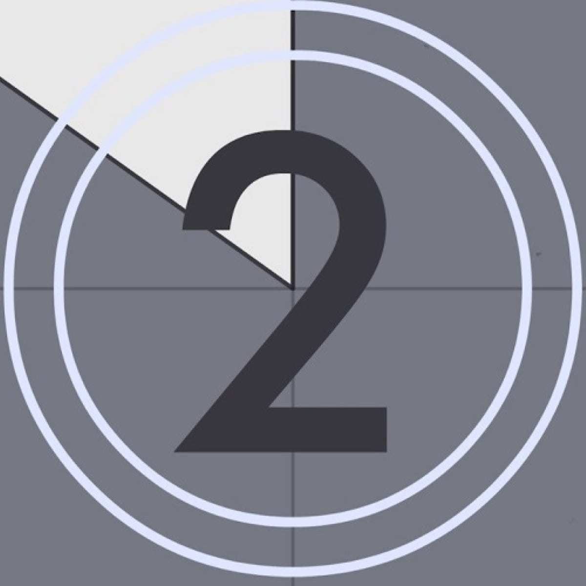

<h1 align="center">
  
</h1>

<p align="center">
  
</p>


## 💻 Project

An example of countdown project.

## ✨ Technologies

- [ ] Expo CLI

## Running the project

Use **yarn** or **npm install** to install project dependencies. Then start the
project.

```cl
npx expo start
```

## Running the tests

Use **yarn jest -u** or **yarn test** to execute the jest tests.

```cl
yarn jest or yarn test
```

<br />

# Project Structure

```bash
├── assets
│   └── fonts
│   └── icons
│   └── images
├── components
```

<div align="center">
  <small>Developed By Alexandre Marques - 2023/Out</small>
</div>
